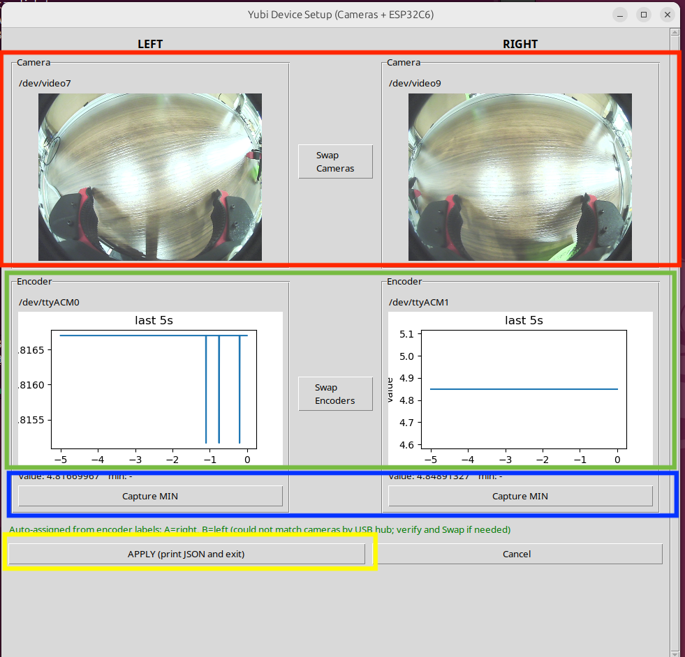

# YUBI (Yielding Universal Bidigital Interface)

🌐 **Project page: [yubi.airoa.io](https://yubi.airoa.io/)**

<p align="center">
  
</p>

YUBI is a two-handed **operation interface** for collecting robot
manipulation data. This repository is the operator-side **bringup** — it
launches the hardware (encoders, hand cameras, footpedal or Quest
controllers) and wires it through ROS 2 to the data-collection backend.

## Related projects

The YUBI data collection stack is made up of several components:

- **[yubi-app](https://github.com/airoa-org/yubi-app)** — data collection app (operator-facing).
- **[yubi-core](https://github.com/airoa-org/yubi-core)** — ROS 2 backend for recording, uploading, and managing operation episodes.
- **[rebake](https://github.com/airoa-org/rebake)** — decode a ROS bag once, query it like a database, and bake it into LeRobot training data.

## Quick setup guide

> 🚧 **Under construction — stay tuned for the updates.**

## Dependencies

- docker
- docker compose
- make

## Initial Setup

### Gripper setup (ESP32C6)

Each gripper's open/close angle is read by a Seeed XIAO ESP32C6 running the
AS5601 encoder firmware in [firmware/ESP32C6_AS5601/](firmware/ESP32C6_AS5601).
Flash it once per gripper board:

1. Install the [Arduino IDE](https://www.arduino.cc/en/software/) and add ESP32
   board support, then select the **XIAO_ESP32C6** board (see the
   [Seeed getting-started guide](https://wiki.seeedstudio.com/ja/xiao_esp32c6_getting_started/)).
2. Open [ESP32C6_AS5601.ino](firmware/ESP32C6_AS5601/ESP32C6_AS5601.ino) and set
   `DEVICE_ID` to the side plus a 3-digit index — `L###` for the left gripper,
   `R###` for the right (e.g. `L003` / `R003`).
3. Upload to the board, then repeat for each gripper.

### PC setup (operator machine)

1. **Clone this repository (with submodules)**

   ```bash
   git clone https://github.com/airoa-org/yubi-sw.git --recursive
   cd yubi-sw
   ```

2. **Create udev rules and calibrate the encoders (host machine)**

   ```bash
   cd tools
   sudo -E bash yubi_udev_setup.sh          # add --variant portable on the portable rig
   ```

   The `--variant` option tells the script which hardware configuration to expect, which sets how many cameras the GUI looks for:

   - `stationary` (default) — yagura rig, two hand cameras (**left/right**).
   - `portable` — handheld rig, three cameras (**left/right** + a **center/head** camera).

   It defaults to `stationary`, so pass `--variant portable` only on the portable rig. This mirrors `ROBOT_VARIANT` in `.env` (see [Choose a robot variant](#initial-setup) and [Variants](#variants)).

   While it runs, a **Yubi Device Setup** window opens so you can confirm the left/right device assignment and capture each gripper's closed position before the rules are written. The window is variant-aware and shows the cameras listed above for the selected variant.

   

   In the GUI (each marker matches the colored frame around that section in the screenshot above):

   - 🟥 **Cameras** — each panel shows a live feed. Move the left and right grippers and confirm the matching panel reacts. If left/right are reversed, click **Swap Cameras**.
   - 🟩 **Encoders** — each panel shows the live open/close value. Open and close the grippers and confirm the value tracks the motion. If left/right are reversed, click **Swap Encoders**. (If no value appears, reseat the gripper's USB cable and re-run the script.)
   - 🟦 **Capture MIN** — with a gripper held fully closed, click **Capture MIN** on that side. Do this for both grippers.
   - 🟨 **APPLY** — click **APPLY** to write the config and exit; **Cancel** aborts without writing.

   The script enumerates both USB cameras (UVC) and MCP2210-based encoders, records open/close limits, and writes:
   - `/etc/yubi/encoder_limits.yaml` (consumed by `encoder_node`)
   - `/etc/udev/rules.d/99-yubi.rules` (creates `/dev/yubi_*` symlinks)

   Replug the devices afterward (or run `sudo udevadm trigger`).

   > If `docker.yubi.service` is installed and active, the script stops it
   > before rewriting udev rules. When the service unit is not present but a
   > `yubi` container is running directly (e.g. started via `docker compose
   > up`), the script stops that container instead — otherwise it holds
   > `/dev/video*` and camera open fails. When neither is present the stop is
   > skipped. The script does **not** restart yubi on exit; bring it back up
   > yourself with `docker compose up -d` when setup is done.

   **Optional: Wired DHCP for Quest**

   If you connect the Meta Quest to this PC over USB-Ethernet instead of
   Wi-Fi, run `tools/yubi_dhcp_setup.sh` to make this PC a DHCP server
   on that NIC and (optionally) pin a fixed IP for the Quest:

   ```bash
   # ip link  -> note the USB-Ethernet adapter name, e.g. enxAABBCCDDEEFF
   sudo ./tools/yubi_dhcp_setup.sh setup enxAABBCCDDEEFF \
       --quest-mac AA:BB:CC:DD:EE:FF --quest-ip 10.0.0.10
   ```

   The script assigns the static IP via whichever network backend is already
   active on the host (NetworkManager connection profile if NM is running,
   otherwise a netplan file), then writes `/etc/default/isc-dhcp-server`,
   `/etc/dhcp/dhcpd.conf`, and an auto-restart hook (a udev rule + an NM
   dispatcher script on NM hosts) so the service comes back up cleanly when
   the NIC is re-plugged. Other subcommands:

   - `sudo ./tools/yubi_dhcp_setup.sh restart` — manual fallback when the
     udev rule did not fire after a NIC re-plug.
   - `sudo ./tools/yubi_dhcp_setup.sh status` — show service state, the
     UDP :67 listener, and recent leases.
   - `sudo ./tools/yubi_dhcp_setup.sh remove` — undo everything (restores
     the `.bak` of `/etc/default/isc-dhcp-server` and `/etc/dhcp/dhcpd.conf`).

   See `./tools/yubi_dhcp_setup.sh --help` for all options.

   **Optional: Prevent suspend on laptop lid close**

   When running the bringup on a laptop that needs to keep recording with
   the lid shut, install a `systemd-logind` drop-in that ignores the lid
   switch:

   ```bash
   sudo ./tools/yubi_lid_setup.sh apply     # ignore lid close (no suspend)
   sudo ./tools/yubi_lid_setup.sh reset     # restore distro default
   ./tools/yubi_lid_setup.sh status         # show current lid-switch policy
   ```

   `apply` writes `/etc/systemd/logind.conf.d/99-yubi-lid.conf` with
   `HandleLidSwitch=ignore` / `HandleLidSwitchExternalPower=ignore` /
   `HandleLidSwitchDocked=ignore` and restarts `systemd-logind`. The
   distro's main `/etc/systemd/logind.conf` is left untouched, so `reset`
   just unlinks the drop-in.

3. **Configure environment variables**

   ```bash
   cp .env.example .env
   ```

   `.env` controls docker-compose (data paths, MinIO credentials, optional
   overrides). See `.env.example` for the full list.

4. **Choose a robot variant**

   Set `ROBOT_VARIANT` in `.env` to one of:

   - `stationary` (default) — yagura frame, RealSense head camera, footpedal
   - `portable` — handheld frame, USB center camera, Quest controller buttons

   See [Variants](#variants) below for what each variant launches.

5. **Create per-host config overrides (Quest IP, API key, etc.)**

   Per-host secrets / per-machine tweaks live in
   `yubi_bringup/config/local/<file>.yaml`. That directory is gitignored
   and is merged on top of `common/` and `<variant>/` when configs are built.
   Example for the backend API key and the Quest IP:

   ```yaml
   # yubi_bringup/config/local/robot_config.yaml
   /**:
     ros__parameters:
       api_key: "your-real-api-key"
       base_url: "http://x.x.x.x:8000/api"   # your backend host (yubi-app backend listens on :8000)
   ```

   ```yaml
   # yubi_bringup/config/local/yubi_devices.yaml
   quest_bridge_node:
     ros__parameters:
       quest_ip: "x.x.x.x"   # your Quest's IP
   ```

   If you set up the wired DHCP link above, set `quest_ip` here to the same
   address you passed as `--quest-ip` to `tools/yubi_dhcp_setup.sh`.

   No edits to the committed `common/*.yaml` are needed for per-host values.

6. **Build Docker images**

   ```bash
   make docker          # builds both yubi-core and yubi + generates config/_runtime/
   make docker-yubi-core      # yubi-core only
   make docker-yubi   # yubi only
   make build-config    # regenerate config/_runtime/<variant>/ from common + <variant> [+ local]
   ```

   `make docker` runs `build-config` first so the merged runtime config is
   present before container start. Re-run `make build-config` whenever you
   edit anything in `yubi_bringup/config/{common,stationary,portable,local}/`.

   Or with docker compose. The `yubi_core_builder` service is
   gated by the `build-only` profile so it is excluded from a plain
   `docker compose build`; pass the profile to build it:

   ```bash
   docker compose --profile build-only build yubi_core_builder
   docker compose build yubi web_video_server
   ```

   `make docker` is the simpler path and is what CI uses.

### Quest setup (Meta Quest headset)

The YUBI operation interface runs as a sideloaded app on a Meta Quest
headset. Download the latest APK and install it over USB with `adb`.

1. **Download the APK**

   ```bash
   wget https://releases.dev.airoa.io/yubi/quest-app/yubi-quest-app-v0.1.0.apk
   ```

2. **Enable Developer Mode on the Quest** (one-time)

   In the Meta Horizon mobile app: *Menu → Devices → select your headset →
   Headset Settings → Developer Mode → on*. Then connect the headset to your
   machine over USB and accept the *Allow USB debugging* prompt inside the
   headset.

3. **Install the APK**

   ```bash
   adb install -r yubi-quest-app-v0.1.0.apk
   ```

   `-r` reinstalls/upgrades over an existing version while keeping its data.

   The app appears in the Quest library under *Unknown Sources* as **YubiQuestApp**.

> Prefer a GUI? [SideQuest](https://sidequestvr.com/) can install the same APK
> by drag-and-drop.

## Usage

1. **Launch the YUBI Quest app**

   Put on the Meta Quest headset and start **YubiQuestApp** (installed
   above under *Unknown Sources*). It must be running before you bring up the
   stack so the `quest_bridge_node` can connect to it (at the `quest_ip` you
   configured) and stream controller / tracking data.

2. **Start the stack**

   ```bash
   docker compose up -d
   ```

   This brings up the full data-collection stack. The `yubi` service runs
   `ros2 launch yubi_bringup yubi_data_collection.launch.py` as its container
   command, so the data-collection system (USB cameras, RealSense pipeline,
   footpedal/Quest input, encoders, rosbridge, and the task command dispatch
   node) starts automatically — you don't need to launch it by hand.

   The `config-init` service runs `build_runtime_configs.py` as a one-shot
   before `yubi_core` starts, so the merged config is
   always fresh on `up`.

## End-to-end data collection

The full workflow across the YUBI stack:

1. **Install the data collection app (yubi-app).** Follow the
   [yubi-app setup guide](https://github.com/airoa-org/yubi-app#setup) to bring
   up its backend + web frontend (and the bundled MinIO used for storage).

2. **Set up a robot and task in the web app** (`http://localhost:3000/web`):
   - **Create a robot** and **issue an API key** for it.
   - **Register that API key** in your robot config — set `api_key` (and
     `base_url` to the yubi-app backend, port `8000`) in
     `yubi_bringup/config/local/robot_config.yaml`.
   - **Create a task** and **assign it to the robot**.

   See the [yubi-app user guide](https://github.com/airoa-org/yubi-app/blob/main/docs/user-guide.md)
   for the details of each step.

3. **Run the bringup and collect data.** Start YUBI (`docker compose up -d`),
   then operate the device to record episodes for the assigned task.

4. **Recordings upload automatically.** When an episode finishes, it is
   uploaded to the **local MinIO** by default. To push to an external/remote
   S3 target instead, configure `upload_targets.yaml` — see the
   [yubi-core upload reference](https://github.com/airoa-org/yubi-core/blob/main/docs/configuration.md#upload_targetsyaml).

5. **Download and process.** Fetch the recordings from MinIO, then turn them
   into training data with [rebake](https://github.com/airoa-org/rebake).

   With the [MinIO client](https://min.io/docs/minio/linux/reference/minio-mc.html) (`mc`):

   ```bash
   mc alias set yubi http://localhost:9000 minioadmin minioadmin
   mc cp --recursive yubi/data/ ./recordings/
   ```

   …or with the AWS CLI:

   ```bash
   aws --endpoint-url http://localhost:9000 s3 cp --recursive s3://data/ ./recordings/
   # credentials: AWS_ACCESS_KEY_ID=minioadmin AWS_SECRET_ACCESS_KEY=minioadmin
   ```

## Services

The `docker-compose.yml` starts the following services:

| Service | Container name | Description |
|---------|----------------|-------------|
| `minio` | `minio` | S3-compatible object storage for recordings |
| `minio-init` | `minio-init` | One-shot init container that creates the `data` bucket |
| `yubi` | `yubi` | Yubi bringup: hardware drivers, cameras, footpedal, rosbridge, task command dispatch |
| `yubi_core` | `yubi_core` | AIRoA data collection: task receiver, record manager, recording gate, recording uploader, task sequence manager |
| `yubi_core_builder` | _(build-only)_ | Image build target for the `yubi_core` Dockerfile. Gated by the `build-only` compose profile so it is not started at runtime. |
| `web_video_server` | `web_video_server` | HTTP video stream server for camera feeds |
| `lock_server` | `lock_server` | Broadcasts the available robot UUIDs (HTTP `GET /v1/robot` on `127.0.0.1:28080`), consumed by the yubi-app frontend to pick a robot |

> Use the **service** name with `docker compose` subcommands
> (e.g. `docker compose logs yubi_core`) and the
> **container** name with raw docker (`docker exec -it yubi_core bash`).

> **Lock server / yubi-app frontend:** the `lock_server` advertises which robot
> UUIDs are available on this operator machine. To use it, set the lock-server
> URL (default `http://localhost:28080`) in the **yubi-app frontend's `.env`**
> so the app can list and select robots.

## Variants

A **variant** captures a hardware configuration (e.g. yagura vs handheld).
The active variant is selected by `ROBOT_VARIANT` in `.env` (or per-invocation
via `ros2 launch ... robot_variant:=portable`).

### Variants today

| Variant | Center camera | Task input | `robot_type` |
|---|---|---|---|
| `stationary` | RealSense (`/camera/camera/*`) | Footpedal | `"yubi"` |
| `portable`   | USB cam (`/center_camera/*`)   | Quest controller buttons + gripper state | `"yubi_portable"` |

Both variants run the encoder node, the two hand USB cameras, and the Quest bridge.

### Config layout

```
yubi_bringup/config/
├── common/                       # shared across all variants
│   ├── yubi_devices.yaml      # hand cameras, quest_bridge, encoder
│   ├── robot_config.yaml         # backend / S3 / metadata / common record_topics
│   ├── recording_gate.yaml       # common health / TF / vr_tracking / duration
│   └── upload_targets.yaml
├── stationary/                   # overlay on top of common/
├── portable/                     # overlay on top of common/
├── local/                        # gitignored per-host overlay (3rd layer)
└── _runtime/<variant>/           # gitignored, generated by build_runtime_configs.py
```

### Merge mechanism

There are two parallel layers, both driven by `ROBOT_VARIANT`:

- **`yubi_devices.yaml`**: loaded by ROS 2 launch as a multi-params YAML
  stack (`parameters=[common, variant, local]`). The launch file is
  **presence-driven**: a node spawns only when its YAML key appears in the
  merged keyset. To add hardware, drop a section into common or a variant and add
  an entry to `yubi_bringup/yubi_bringup/launch_registry.py`.

- **`robot_config.yaml` / `recording_gate.yaml` / `upload_targets.yaml`**:
  pre-merged by `yubi_bringup/tools/build_runtime_configs.py` into
  `config/_runtime/<variant>/`, then mounted into the data-collection
  container. Run `make build-config` after editing any of these.

Merge semantics: dicts merge recursively; lists in an overlay replace the
base list; use `key: {__extend__: [...]}` in an overlay to append items.

### Variant-specific overrides on the command line

```bash
ros2 launch yubi_bringup yubi_data_collection.launch.py robot_variant:=portable
```

This bypasses `.env` for a single launch. The mounted runtime YAMLs still
follow `ROBOT_VARIANT` from compose; rebuild with
`ROBOT_VARIANT=portable docker compose up -d --force-recreate config-init`
if you need the data-collection container to see the portable configs.

## Manual Usage

Enter the yubi container:
```bash
docker compose exec yubi bash
```

### Launch the full bringup (inside the container)

```bash
ros2 launch yubi_bringup yubi_data_collection.launch.py
```

The launch file starts USB cameras, the RealSense pipeline, the footpedal node, rosbridge websocket, and the task command dispatch node.

### Rebuild the workspace (inside the container)

```bash
colcon build --symlink-install
source install/setup.bash
```

Re-run `colcon build` whenever you change the Python packages; URDF/Xacro edits do not require rebuilding.

## Troubleshooting

1. **A gripper finger doesn't move** — reseat (unplug/replug) that gripper's USB
   cable. If it still doesn't move, re-run the udev setup
   (`cd tools && sudo -E bash yubi_udev_setup.sh`, see
   [PC setup](#pc-setup-operator-machine)).

2. **A gripper pose isn't tracked** — check that the YUBI Quest app
   (**YubiQuestApp**) is running on the headset (see
   [Usage](#usage)).

3. **A camera doesn't work** — reseat (unplug/replug) that camera's USB
   cable. If it still doesn't work, re-run the udev setup
   (`cd tools && sudo -E bash yubi_udev_setup.sh`, see
   [PC setup](#pc-setup-operator-machine)).

## Development

```bash
make help          # Show available targets
make lint          # Run ruff linter and formatter check
make test          # Run unit tests with pytest
make test-config   # Run only the build_runtime_configs / variant tests
make build-config  # Regenerate config/_runtime/<variant>/ from common + variant [+ local]
make docker        # Build all Docker images (yubi + yubi-core)
```

## Contributors

- Khrapchenkov Petr
- Takuya Okubo
- Naoaki Kanazawa
- Miki Ma
- Naruya Kondo
- Jumpei Arima
- Yuki Noguchi


## Contributing

Contributions are welcome! See [CONTRIBUTING.md](CONTRIBUTING.md) for development
setup and guidelines, and our [Code of Conduct](CODE_OF_CONDUCT.md).

## Citation

If you use YUBI in your research, please cite:

```bibtex
@techreport{ohkawa2026yubi,
  author      = {Takehiko Ohkawa and Jumpei Arima and Yuki Noguchi and
                 Masatoshi Tateno and Makoto Sugiura and Takuya Okubo and
                 Kengo Ikeuchi and Yuma Shin and Hiroki Nishizawa and
                 Naoaki Kanazawa and Yuki Wakayama and Daiki Fukunaga and
                 Koshi Makihara and Tomohiro Motoda and Floris Erich and
                 Yukiyasu Domae and Tatsuya Matsushima and Yohishiro Okumatsu and
                 Kei Ota},
  title       = {{YUBI}: Yielding Universal Bidigital Interface for
                 Bimanual Dexterous Manipulation at Scale},
  year        = {2026},
}
```

## License

This project is licensed under the [Apache License 2.0](LICENSE).
